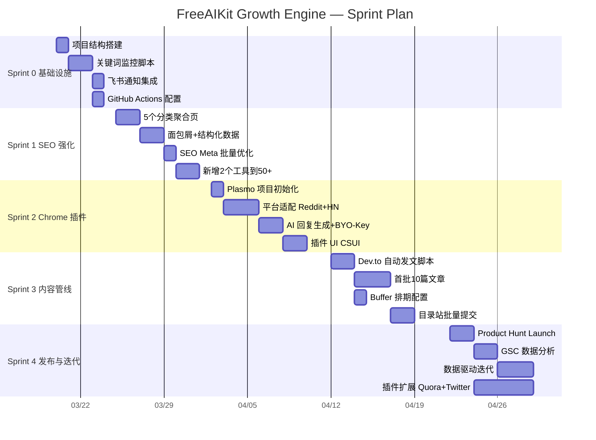
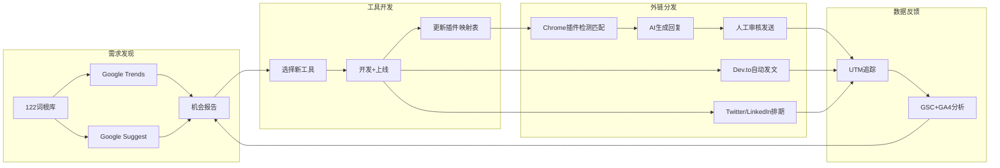

# FreeAIKit Growth Engine — 项目主文档

> 统一项目，统一入口，Sprint 迭代开发
> 最后更新：2026-03-19

---

## 一、项目定义

### 项目名称
**FreeAIKit Growth Engine**

### 一句话描述
一个统一的增长系统：关键词挖掘 → 工具开发 → 站点优化 → 外链分发，全部集成在一个项目中。

### 为什么要统一？
之前规划分散在多个脚本、插件、工具中，入口太多。现在合并为：
- **一个仓库**：freeaikit（现有 Next.js 项目扩展）
- **一个 Chrome 插件**：集成关键词监控 + 外链助手 + 内容生成
- **一套自动化脚本**：GitHub Actions 驱动，结果推送飞书

### 项目架构

```
freeaikit/                          # 统一仓库
├── src/                            # Next.js 主站（已有）
│   ├── app/                        # 48 个工具页面
│   ├── app/components/             # 共享组件
│   └── app/[category]-tools/       # 【新增】分类聚合页
│
├── extension/                      # 【新增】Chrome 插件（Plasmo）
│   ├── src/
│   │   ├── background/             # Service Worker（AI API 调用）
│   │   ├── contents/               # Content Scripts（平台适配）
│   │   │   ├── reddit.ts
│   │   │   ├── quora.ts
│   │   │   ├── twitter.ts
│   │   │   ├── hackernews.ts
│   │   │   └── devto.ts
│   │   ├── components/             # 页面注入 UI（CSUI）
│   │   │   └── ReplyAssistant.tsx  # 回复建议浮窗
│   │   ├── popup/                  # 插件弹窗（设置 + 状态）
│   │   └── lib/
│   │       ├── tool-keywords.ts    # 工具-关键词映射表
│   │       ├── prompt-templates.ts # 各平台 AI Prompt 模板
│   │       └── api-client.ts       # OpenAI/Claude API 调用
│   ├── package.json
│   └── plasmo.config.ts
│
├── scripts/                        # 【新增】自动化脚本
│   ├── keyword-monitor/
│   │   ├── trends_monitor.py       # Google Trends 飙升词
│   │   ├── suggest_monitor.py      # Google Suggest 联想词
│   │   ├── report_generator.py     # 机会报告合并
│   │   └── feishu_notify.py        # 飞书推送
│   ├── content-generator/
│   │   ├── devto_publisher.py      # Dev.to 自动发文
│   │   └── templates/              # 文章模板
│   └── seo-audit/
│       └── gsc_analyzer.py         # GSC 数据分析
│
├── .github/workflows/              # 【新增】GitHub Actions
│   ├── keyword-monitor.yml         # 每日关键词监控
│   └── devto-publish.yml           # Dev.to 发文
│
├── data/                           # 【新增】自动化产出数据
│   └── keywords/                   # 每日关键词报告
│
├── docs/                           # 【新增】项目文档
│   └── project-master-plan.md      # 本文档
│
├── public/                         # 静态资源（已有）
├── package.json                    # 主站依赖（已有）
├── next.config.ts                  # 已有
└── CLAUDE.md                       # 已有
```

---

## 二、OpenAI OAuth / BYO-Key 方案

### 问题
Chrome 插件需要调用 AI API 生成回复，谁来付 API 费用？

### 方案：BYO-Key（Bring Your Own Key）

用户在插件设置中填入自己的 API Key，插件直接调用，**我们零成本**。

#### 支持的 API 提供商

| 提供商 | 模型 | 成本（用户自付） | 接入难度 |
|--------|------|-----------------|---------|
| OpenAI | gpt-4o-mini | ~$0.001/条回复 | 低 |
| Anthropic | claude-haiku | ~$0.001/条回复 | 低 |
| Google | gemini-flash | 免费额度内 | 低 |
| 本地模型 | Ollama API | 完全免费 | 中 |

#### 插件设置页面设计

```
┌─────────────────────────────────────┐
│  FreeAIKit Growth Engine 设置        │
│                                     │
│  🔑 AI API 配置                     │
│  ┌─────────────────────────────┐    │
│  │ 提供商：[OpenAI ▼]          │    │
│  │ API Key：[sk-...        ]   │    │
│  │ 模型：  [gpt-4o-mini ▼]    │    │
│  │ [测试连接]  ✅ 连接成功     │    │
│  └─────────────────────────────┘    │
│                                     │
│  📊 今日统计                        │
│  生成回复：3/5（日限额）             │
│  已发布：2 条                        │
│  覆盖平台：Reddit, Quora            │
│                                     │
│  ⚙️ 安全设置                        │
│  每日回复上限：[5]                   │
│  含链接比例：[33%]                   │
│  同工具冷却：[24h]                   │
└─────────────────────────────────────┘
```

#### 为什么不用 OpenAI OAuth？
- OpenAI OAuth 主要用于 ChatGPT 插件生态，不适用于独立 Chrome 插件
- OAuth 流程复杂，且用户需要 ChatGPT Plus 订阅
- BYO-Key 更简单：用户粘贴 Key → 存入 chrome.storage.local（加密）→ 直接调用
- 支持多家 API，不绑定单一供应商

#### 进阶：免费模式
- 对于没有 API Key 的用户，可以提供"模板模式"
- 不调用 AI，而是基于预设模板 + 变量替换生成回复
- 质量低一些，但完全免费，降低使用门槛

---

## 三、配图与设计方案

### 3.1 需要的图片类型

| 图片 | 用途 | 制作方式 |
|------|------|---------|
| 项目架构图 | 文档/飞书 | Excalidraw → 导出 SVG/PNG |
| Sprint 甘特图 | 项目管理 | Mermaid Gantt → 飞书内嵌 |
| 插件 UI 原型 | 开发参考 | Figma / 直接 HTML+Tailwind |
| 数据流程图 | 技术文档 | Mermaid Flowchart |
| 工具-关键词映射图 | 策略文档 | 表格即可 |

### 3.2 Mermaid 甘特图（Sprint 总览）



### 3.3 数据流程图



### 3.4 插件 UI 设计规范

- **配色**：与 FreeAIKit 主站一致，深蓝色系（#0369a1 主色）
- **浮窗尺寸**：360px × 400px，右下角固定
- **字体**：Inter，14px 正文
- **圆角**：12px 容器，8px 按钮
- **动画**：浮窗从右下角滑入，200ms ease-out
- **暗色模式**：跟随系统/平台（Reddit 暗色时插件也暗色）

---

## 四、Sprint 详细规划

### Sprint 0：基础设施搭建（3/19 提前完成 ✅）

**目标：** 关键词监控系统上线，每天自动推送机会报告到飞书。

| # | 任务 | 产出 | 状态 |
|---|------|------|------|
| 0.1 | 创建项目目录结构 | extension/ scripts/ data/ docs/ | ✅ 完成 |
| 0.2 | 编写 trends_monitor.py | Google Trends 飙升词监控 | ✅ 完成 |
| 0.3 | 编写 suggest_monitor.py | Google Suggest 自动补全监控 | ✅ 完成（测试5词根→138机会） |
| 0.4 | 编写 report_generator.py | 合并去重排序+Bitable同步 | ✅ 完成 |
| 0.5 | 编写 feishu_notify.py | 飞书群 Webhook 推送 Top20 | ✅ 完成 |
| 0.6 | 编写 feishu_bitable.py | 飞书多维表格自动同步（去重） | ✅ 完成（额外新增） |
| 0.7 | 配置 keyword-monitor.yml | GitHub Actions 每日定时 | ✅ 完成 |
| 0.8 | 飞书多维表格建表 | OpenClaw Base 中"关键词机会"表 | ✅ 完成（tbl9yk0J67xFBJ2N） |
| 0.9 | 配置 GitHub Secrets | 3个Secret | ⏳ 待用户配置 |
| 0.10 | Push 代码激活 Actions | 推送到 GitHub | ⏳ 待执行 |

**技术要点：**
- pytrends 限流：random sleep 20-35s + 3次重试(60s/120s/180s退避)
- 飞书 Webhook + Bitable 双通道：群通知 + 多维表格持久化
- report_generator.py 自动调用 feishu_bitable.sync_opportunities()
- 122 词根硬编码在 config.py 中
- 多维表格自动去重：写入前查询已有关键词
- 输出 JSON schema：`{keyword, root, trend_score, source, discovered, already_have, suggested_slug}`

---

### Sprint 1：SEO 强化（3/25 - 4/1，8天）

**目标：** 站点 SEO 基础设施升级，工具数突破 50。

| # | 任务 | 产出 | 验收标准 |
|---|------|------|---------|
| 1.1 | 创建 CategoryPage 组件 | 通用分类聚合页组件 | 接受 category 参数渲染 |
| 1.2 | 创建 5 个分类路由 | /image-tools 等 5 个页面 | 每页有 H1+介绍+卡片+ItemList schema |
| 1.3 | 创建 Breadcrumb 组件 | 面包屑导航+BreadcrumbList schema | 所有工具页显示面包屑 |
| 1.4 | 增强 ToolJsonLd | 添加 HowTo schema | 有步骤的工具页输出 HowTo |
| 1.5 | 升级 RelatedTools | 同类3+跨类2 | 跨类推荐逻辑生效 |
| 1.6 | SEO Meta 批量优化 | 48页 title/desc 更新 | 按新公式：Free {Name} Online - {Verb} {Object} |
| 1.7 | 开发 Diff Checker | 新工具上线 | /diff-checker 可用，纯前端文本对比 |
| 1.8 | 开发 Gradient Generator | 新工具上线 | /gradient-generator 可用 |
| 1.9 | 更新 sitemap + 导航 | sitemap.xml + Header | 新页面全部收录 |
| 1.10 | Build + Deploy + 验证 | 生产环境更新 | Cloudflare Pages Production |

**Title 公式：**
```
Free {Tool Name} Online - {Action Verb} {Object} Instantly | FreeAIKit
```

**Description 公式：**
```
{Action verb} {object} for free in your browser with {tech}. No signup, no file upload. {USP}. Try it now!
```

---

### Sprint 2：Chrome 插件 MVP（4/2 - 4/11，10天）

**目标：** 插件可在 Reddit、HN、Dev.to 上辅助生成回复，支持 BYO-Key。

| # | 任务 | 产出 | 验收标准 |
|---|------|------|---------|
| 2.1 | Plasmo 项目初始化 | extension/ 骨架 | plasmo dev 能跑 |
| 2.2 | Popup 设置页 | API Key 配置 UI | 输入 Key → 存储 → 测试连接成功 |
| 2.3 | API Client 模块 | 统一 AI 调用层 | 支持 OpenAI / Claude / Gemini 切换 |
| 2.4 | 工具-关键词映射表 | tool-keywords.ts | 48 个工具全覆盖 |
| 2.5 | 平台 Prompt 模板 | prompt-templates.ts | Reddit/HN/Dev.to/Quora/Twitter 各一套 |
| 2.6 | Reddit Content Script | contents/reddit.ts | 检测帖子 → 匹配工具 → 弹出提示 |
| 2.7 | HN Content Script | contents/hackernews.ts | 同上，HN 适配 |
| 2.8 | Dev.to Content Script | contents/devto.ts | 同上，Dev.to 适配 |
| 2.9 | ReplyAssistant CSUI | 页面注入浮窗 | 显示建议 → 填入回复框 → 人工发送 |
| 2.10 | 安全限制系统 | 频率/比例/冷却控制 | 日限5条，链接比例33%，24h冷却 |
| 2.11 | 本地测试 | 全流程测试 | Reddit 上实际走通一次完整流程 |

**Content Script 核心逻辑（Reddit 示例）：**
```typescript
// contents/reddit.ts
import type { PlasmoCSConfig } from "plasmo"

export const config: PlasmoCSConfig = {
  matches: ["*://www.reddit.com/r/*/comments/*"]
}

// 1. 提取帖子标题和内容
const title = document.querySelector('h1')?.textContent
const body = document.querySelector('[data-test-id="post-content"]')?.textContent

// 2. 匹配工具关键词
const match = findMatchingTool(title + ' ' + body)

// 3. 如果匹配，通知 background 弹出 CSUI
if (match) {
  chrome.runtime.sendMessage({ type: 'TOOL_MATCH', tool: match, context: { title, body } })
}
```

**回复框填充（Reddit markdown 模式）：**
```typescript
const textarea = document.querySelector('textarea[name="body"]') as HTMLTextAreaElement
if (textarea) {
  // React controlled input 需要用 nativeInputValueSetter
  const nativeSetter = Object.getOwnPropertyDescriptor(
    HTMLTextAreaElement.prototype, 'value'
  )?.set
  nativeSetter?.call(textarea, generatedReply)
  textarea.dispatchEvent(new Event('input', { bubbles: true }))
}
```

---

### Sprint 3：内容管线（4/12 - 4/21，10天）

**目标：** Dev.to 自动发文就绪，首批 10 篇文章上线，外链分发流程跑通。

| # | 任务 | 产出 | 验收标准 |
|---|------|------|---------|
| 3.1 | Dev.to 文章模板引擎 | templates/ 4 个模板 | 图片/PDF/开发者/SEO 各一模板 |
| 3.2 | devto_publisher.py | 自动发文脚本 | 传入 tool slug → 生成文章 → API 发布 |
| 3.3 | 发布首批 10 篇文章 | 10 篇 Dev.to 文章 | canonical_url 指向主站 |
| 3.4 | Buffer 配置 | Twitter + LinkedIn 排期 | 注册+授权+首批排期 |
| 3.5 | UTM 参数体系 | 所有外链加 UTM | GA4 中可追踪各渠道 |
| 3.6 | 目录站提交清单 | 10+ 站提交 | Alternative To, SaaSHub, BetaList 等 |
| 3.7 | Reddit PRAW 监控 | 监控脚本+飞书推送 | 匹配帖子自动推送通知 |
| 3.8 | 新工具上线 SOP 文档 | SOP Checklist | Day0-Day7 分发流程标准化 |
| 3.9 | devto-publish.yml | GitHub Actions | 手动触发传入 slug → 自动发文 |
| 3.10 | 日常外链 SOP | 30min/天操作流程 | 文档化+插件辅助 |

**Dev.to 文章模板（图片工具类）：**
```markdown
---
title: "How to {Action} {Object} for Free Online — No Signup Required"
tags: [webdev, tools, productivity, tutorial]
canonical_url: https://freeaikit.app/{slug}
---

## The Problem
{1-2 sentences: why users need this, what pain point it solves}

## The Solution
FreeAIKit's **{Tool Name}** runs entirely in your browser using WebAssembly.
Your files never leave your device — zero privacy concerns.

### Key Features
- 100% browser-based (powered by {WASM tech})
- No signup or account required
- Free with no watermarks or limits
- {tool-specific feature}

## How to Use It
1. Open [{Tool Name}](https://freeaikit.app/{slug})
2. {Step 2: upload/paste/enter}
3. {Step 3: adjust settings}
4. {Step 4: download result}

## Under the Hood
{1-2 paragraphs about the WASM technology — Dev.to readers appreciate technical depth}

---
*Built with Next.js + WebAssembly. [Try all 50+ tools at FreeAIKit.app](https://freeaikit.app)*
```

---

### Sprint 4：发布与数据驱动迭代（4/22 - 4/30，9天）

**目标：** Product Hunt Launch，GSC 数据分析，根据数据调整策略。

| # | 任务 | 产出 | 验收标准 |
|---|------|------|---------|
| 4.1 | Product Hunt 素材准备 | Logo+截图+Tagline+Description | 符合 PH 规范 |
| 4.2 | Product Hunt Launch | PH 上线 | 提交成功，获得投票 |
| 4.3 | 扩展插件：Quora 适配 | contents/quora.ts | Quora 上走通完整流程 |
| 4.4 | 扩展插件：Twitter 适配 | contents/twitter.ts | Twitter 上走通完整流程 |
| 4.5 | GSC 数据导出+分析 | gsc_analyzer.py | 四象限矩阵报告生成 |
| 4.6 | 高展示低CTR 工具优化 | Title/Desc 修改 | 基于数据精准优化 |
| 4.7 | 低展示高CTR 工具推广 | 定向外链 | 为优质内容补外链 |
| 4.8 | 关键词报告回顾 | 30天数据 | 评估哪些新词值得做新工具 |
| 4.9 | Sprint 5 规划 | 下一轮计划 | 基于数据制定 |

---

## 五、每日操作 SOP（Sprint 2 之后）

### 早上（15 分钟）
1. 检查飞书通知 — 关键词监控报告（有新飙升词？）
2. 检查飞书通知 — Reddit PRAW 监控（有匹配帖子？）
3. 对匹配帖子打标记，决定今天回复哪些

### 工作间隙（15 分钟，可拆分）
4. 打开 Reddit，浏览标记的帖子 → 插件辅助生成回复 → 审核发送
5. 打开 Quora，浏览 1-2 个匹配问题 → 插件辅助回答
6. 顺手在 Reddit/Quora 上做 2-3 条不带链接的纯互动（养号）

### 周一/周四额外（15 分钟）
7. 确认 Dev.to 新文章已发布
8. 检查 Buffer 排期是否正常

### 每周五复盘（30 分钟）
9. GSC 数据快速 check — 展示量/点击/CTR 趋势
10. 本周外链数量统计
11. 关键词报告本周亮点 → 评估是否需要新工具

---

## 六、成本预算

| 项目 | 月成本 | 说明 |
|------|--------|------|
| AI API（用户自付 BYO-Key） | $0 | 我们不承担 |
| GitHub Actions | $0 | 公开仓库免费 |
| pytrends + Google Suggest | $0 | 免费 |
| Dev.to API | $0 | 免费 |
| Buffer 免费版 | $0 | 3 个渠道 |
| Cloudflare Pages | $0 | 已有 |
| 域名 freeaikit.app | ~$10/年 | 已有 |
| **总计** | **$0/月** | BYO-Key 模式零成本 |

可选付费升级：
- DataForSEO 搜索量数据：$25/月（Sprint 0 可选）
- Buffer 付费版：$6/月（需要 > 3 个渠道时）
- SerpAPI：$50/月（pytrends 被限流时升级）

---

## 七、核心 KPI

| 指标 | Sprint 0-1 结束 | Sprint 2-3 结束 | Sprint 4 结束 | 3个月后 |
|------|----------------|----------------|--------------|--------|
| 工具数 | 50 | 50 | 52+ | 60+ |
| 分类聚合页 | 5 上线 | 5 | 5 | 5+子分类 |
| 关键词日报 | 上线 | 稳定运行 | 30天数据 | 90天数据 |
| Chrome 插件 | — | MVP 3平台 | 5平台 | 6+平台 |
| Dev.to 文章 | 0 | 10 | 15 | 40 |
| 日外链操作 | 0 | 开始 | 5-8条/天 | 10+条/天 |
| 外链域名数 | +0 | +10 | +25 | +70 |
| GSC 展示量 | 基线 | 基线×1.2 | 基线×1.5 | 基线×3 |

---

## 八、风险与应对

| 风险 | 概率 | 影响 | 应对 |
|------|------|------|------|
| pytrends 被 Google 限流 | 中 | 关键词监控中断 | 切 SerpAPI（$50/月） |
| Chrome 插件被 Web Store 拒绝 | 低 | 无法分发 | 开发者模式加载，不上架 |
| Reddit 账号被 shadowban | 中 | 失去一个渠道 | 严格遵守10%规则+养号 |
| 竞品跟进同样工具 | 高 | 排名竞争 | 靠先发优势+持续外链 |
| WASM 库更新导致工具破损 | 低 | 工具不可用 | 锁定版本号，测试后再升级 |

---

## 九、Chrome 插件产品化定位

### 9.1 双产品矩阵
- **FreeAIKit 主站**（freeaikit.app）：面向全球用户的免费 AI 工具站，靠 SEO + 广告变现
- **Growth Engine 插件**：面向独立开发者/出海站长的外链助手，订阅制 SaaS 变现
- 两个产品互相导流：主站工具页引导安装插件，插件辅助推广主站

### 9.2 插件三层价值（不靠 AI 也能收费）
- **发现层**（不需要 AI，核心价值）：跨平台扫描匹配帖子，告诉你"这个帖子可以去回复"
- **创作层**（需要 AI，锦上添花）：AI 生成回复内容，BYO-Key 或内置额度
- **管理层**（不需要 AI，高价值）：记录在哪回复过、外链数量、UTM 追踪、数据统计

### 9.3 定价方案
| 套餐 | 价格 | 功能 |
|------|------|------|
| 免费版 | $0 | 2 个平台，每天 3 个匹配高亮，手写回复，基础记录 |
| Pro | $9.9/月 ($99/年) | 全部 6+ 平台，无限匹配，模板库，外链面板，UTM，统计 |
| Pro + AI | $19.9/月 ($199/年) | 以上全部 + AI 回复生成（内置额度或 BYO-Key 享 Pro 价） |

### 9.4 收费方案：LemonSqueezy
- 选择 LemonSqueezy（lemonsqueezy.com）作为支付平台
- 个人即可注册，中国开发者支持，不需要公司/营业执照
- 内置：订阅管理、License Key 生成验证、全球税务自动处理、发票
- 手续费：5% + $0.5/笔，提现到 PayPal 或银行
- 用户流程：官网定价页 → LemonSqueezy 支付 → 获得 License Key → 粘贴到插件激活
- 搭建耗时 1-2 小时，不需要自建后端

### 9.5 竞品分析
| 竞品 | 覆盖 | 价格 | 差异 |
|------|------|------|------|
| GummySearch | 仅 Reddit | $29/月 | 无回复辅助 |
| Syften | 多平台 | $19/月 | 纯监控，不辅助回复 |
| F5Bot | Reddit+HN | 免费 | 极简，只发邮件通知 |
| Brand24 | 全网 | $79+/月 | 面向企业 |
| **我们** | **6+ 平台** | **$9.9/月** | **全链路：监控+匹配+回复+管理** |

### 9.6 上架与兼容性
- **Chrome Web Store**：注册 $5，审核 1-3 天，定位"AI writing assistant"
- **AdsPower 兼容**：完全支持，基于 Chromium。多开 + 插件 = 多账号外链操作绝配
- 建议用本地加载模式（.crx）避免商店兼容问题

### 9.7 开发难度
- **MVP 开发**：中等偏低，Plasmo 成熟，约 2 周
- **长期维护（真正难点）**：平台 DOM 改版导致选择器失效，需持续更新
- **MVP 策略**：先做 Reddit + HN + Dev.to（HN 十几年没改版，维护零成本）
